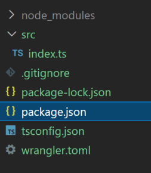
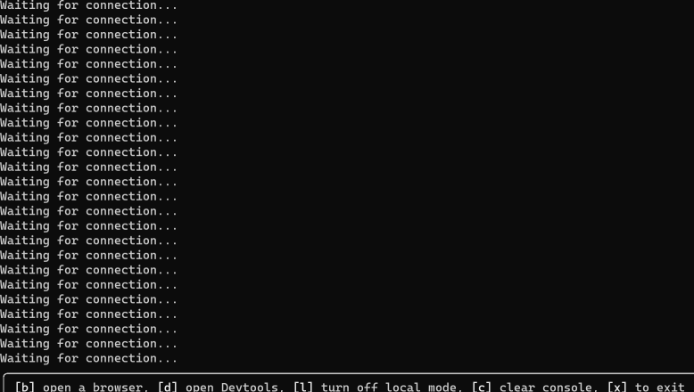
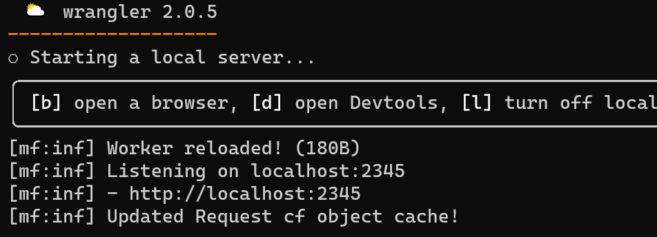

This past week was CloudFlare's _Platform Week_ in which some extremely exciting
announcements were made, and in that spirit I thought I'd start playing around with
Wrangler 2 and Durable Objects, both of which I haven't worked with before. The
result was...not great.  It wasn't terrible, but the documentation are a hodgepodge
of slightly outdated information and a lot of getting started guides without a
cohesive structure, even the API docs are not terribly communicative.

I understand how this could be the case, CloudFlare is moving extremely fast to
provide cloud architecture for full stack applications, and docs are mostly aimed
at getting newcomers up and running by relying on a template rather than
actually breaking down what is actually going on in those config files.

So...I thought it might be fun to document my trying to make something interesting.

[Durable Objects](https://developers.cloudflare.com/workers/learning/using-durable-objects/)
are a really cool tech that provides a guaranteed singular instance of an object,
allowing multiple workers to coordinate state between them. Eventually the plan
is to make a game with this
([there are already examples out there](https://blog.cloudflare.com/doom-multiplayer-workers/))

To start with, I go through the usual set up series.  Wrangler 2 has a handy `init`
command that'll give us a basic setup, so I can simply run `npx wrangler init` in
my intended directory.

We'll be asked a series of questions about what features we want enabled, I just
went ahead and enabled all of them (which includes git, package.json,
and typescript). What we end up with is something like this.



We get an `index.ts` in the new Modules format

```js
export default {
  async fetch(request: Request): Promise<Response> {
    return new Response("Hello World!");
  },
}
```

and we get a pretty minimal `wrangler.toml` to get Wrangler to recognize the
project.

```toml
name = "test"
compatibility_date = "2022-05-16"
```

At this point we can simply start Wrangler in local mode, but if we take a look
at `package.json` we notice that the commands specify the entry explicitly

```json
"scripts": {
  "start": "wrangler dev src/index.ts",
  "publish": "wrangler publish src/index.ts"
}
```
This is fine, but I would rather replace that with a proper configuration inside
our config file
```
// wrangler.toml
name = "durable-object-playground" // Let's name this something mildly more interesting
compatibility_date = "2022-05-16"

// This field specifies the entry for us, so no need to define it in the CLI anymore
main = 'src/index.ts'


// package.json
"scripts": {
  "start": "wrangler dev",
  "publish": "wrangler publish"
}
```

Now that's taken care of, let's add a few more fields to `wrangler.toml`

```toml
...
// I will explicitly specify our TS Config
tsconfig = './tsconfig.json'

// These two fields aren't really needed until we deploy, but let's just do
//   it now anyway
account_id = '<YOUR ACCOUNT ID>'
usage_model = 'bundled' // Or Unbound

// If you have a custom domain set up on your CloudFlare zone, you also need
//   to specify at least one route
route = 'api.your-domain.com'

[dev]
// I'm used to this port so I like to set it
port = 2345
```

Cool, now we can boot up our worker locally with `wrangler dev --local`, although
sometimes this happens



<br />

Wrangler clearly still has some stuff to work out. Just kill it with `x` or
`CTRL + c` and try it again until it spins up properly.


